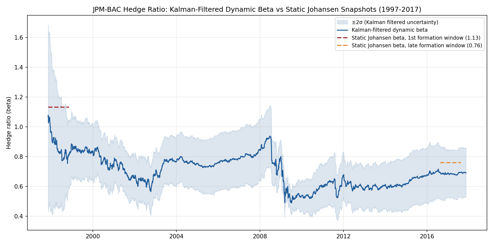
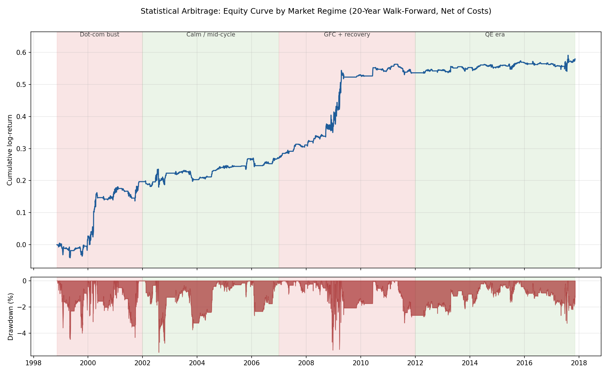
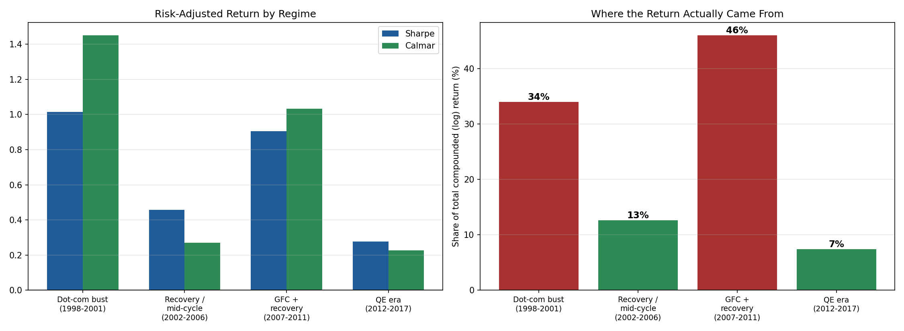
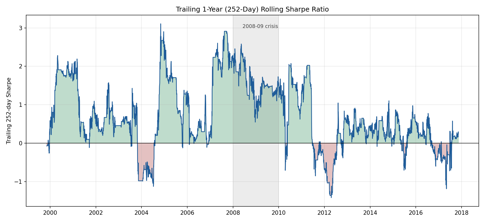
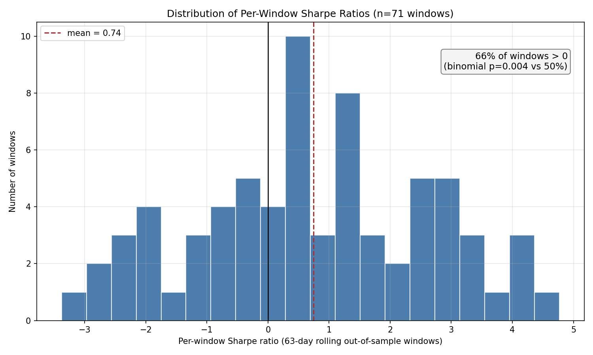
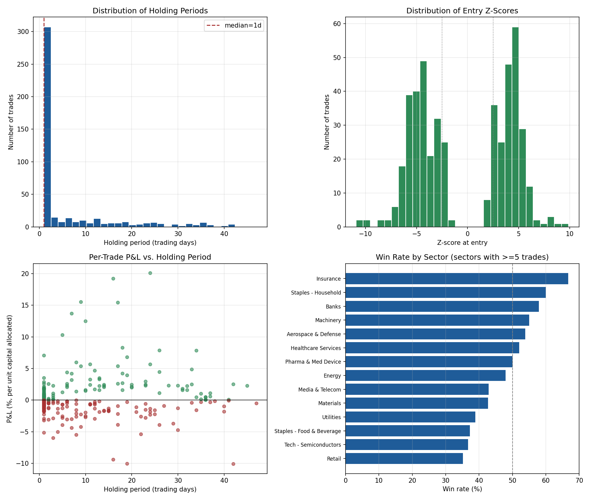
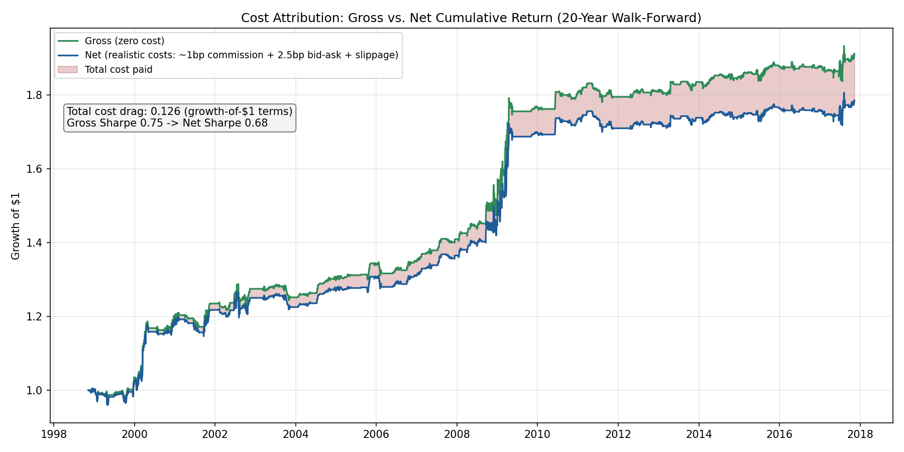
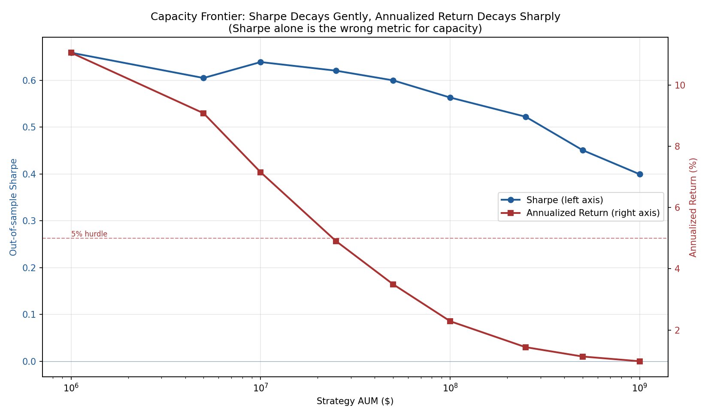
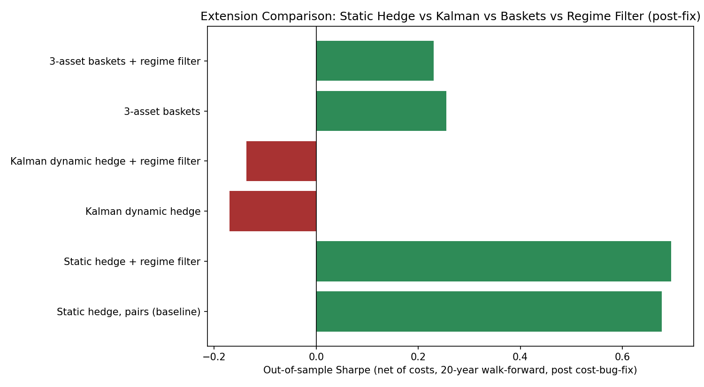
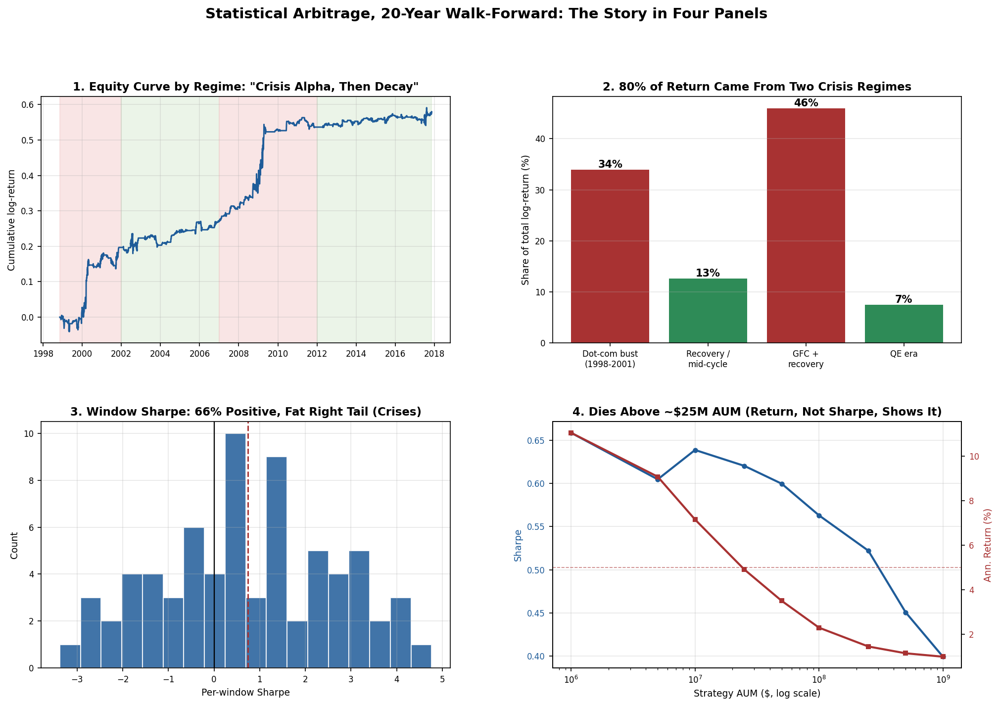

# Statistical Arbitrage: 20-Year Cointegration Pairs Trading

A real-data quantitative research pipeline for cointegration-based pairs trading, built on 128 large and mid-cap US equities over 20 years of daily prices (1997-2017). The core strategy uses Johansen cointegration, Ornstein-Uhlenbeck spread modeling, and z-score entry/exit rules, with a realistic execution and cost model. Three extensions (dynamic hedge ratios, multi-asset baskets, and a regime filter) are tested honestly against the baseline, including the cases where they don't help. No synthetic data is used anywhere: every number below comes from an actual walk-forward backtest against real historical prices.

## Summary

| | |
|---|---|
| Universe | 128 tickers, 22 sectors, large and mid-cap |
| History | 20 years, 1997-11-10 to 2017-11-10 (5,035 trading days) |
| Out-of-sample evaluation | 76 rolling walk-forward windows |
| **Headline Sharpe (net of costs)** | **0.68** (95% bootstrap CI: 0.35 to 1.01) |
| **Survivorship-bias-adjusted Sharpe** | **roughly 0.34 to 0.47**, the more honest number (see limitations) |
| Max Drawdown | -5.5% |
| Calmar | 0.57 |
| Practical capacity | roughly $10-30M AUM before returns fall below a 5% hurdle |
| Where the return came from | 80% of total compounded return from two crisis regimes (1998-2001 and 2007-2011), earned on just 55% of the trading days |

## Data

`data/all_stocks_20yr_raw.csv` holds real daily OHLCV for 148 tickers, consolidated from individual per-ticker files sourced from the historical dataset commonly known as the "Huge Stock Market Dataset" (dividend and split-adjusted daily bars, through 2017-11-10). `src/data_loader.py` restricts the sample to the trailing 20 years and keeps only the 128 tickers with at least 98% trading-day coverage over that window, so the universe is companies that traded continuously through the dot-com crash, 9/11, the 2008 financial crisis, and the 2010s bull market.

Those 128 tickers span 22 sector buckets: semiconductors, software, hardware, banks, insurance, energy, pharma, med devices, healthcare services, staples, retail, restaurants, media and telecom, industrials, aerospace and defense, machinery, railroads, airlines, materials, and utilities, including mid-caps like CPB, LNC, UNM, VMC, MAS, and JWN rather than just megacaps.

## Methodology

**Pair screening.** A Johansen trace test on log-prices identifies candidate pairs, confirmed by an ADF test on the resulting spread (p<0.03) and filtered to a half-life between 8 and 45 trading days, so pairs that revert too fast to be a real relationship or too slowly to be tradeable net of costs get dropped. A sanity guard also rejects any hedge ratio outside 0.05 to 5, since a near-singular Johansen fit can occasionally produce numerically extreme weights.

**OU calibration.** Each surviving spread is fit as an Ornstein-Uhlenbeck process via OLS on its discretized AR(1) form, giving the mean-reversion speed, long-run mean, and the stationary standard deviation used for z-scoring, rather than a rolling sample std that would add a second uncontrolled parameter and risk look-ahead bias.

**Signal and execution.** The strategy enters short the spread at z above 2.5, long at z below -2.5, exits at |z| under 0.75, stops out at |z| above 3.5, and caps holding periods at four times the half-life. A signal decided on day t's close is implemented at day t+1's open, so there's no same-bar execution. Costs run 1.0bp commission plus 2.5bp bid-ask proxy plus 1.5bp slippage per leg per trade, scaled up by a square-root market-impact term when a trade is large relative to volume. A 3% ADV participation cap limits how much of a desired position change can actually fill on a given day, and both P&L and cost are computed from the realized, capacity-constrained fill rather than the signal's target size, so a trade that only fills 60% books 60% of the P&L and 60% of the cost. A minimum-edge filter also skips a pair for a window unless its expected reversion edge exceeds three times the modeled round-trip cost.

**Walk-forward evaluation.** A 252-day formation window is used to screen pairs and fit OU parameters using only in-sample data, followed by a 63-day out-of-sample trading window, stepped forward across the full 20 years for 76 rolling windows. Up to 4 pairs trade concurrently per window, capped at one pair per sector for diversification and equal-weighted by capital.

## Extensions

**Dynamic hedge ratios** (`src/kalman_hedge.py`) replace the formation-window-fixed Johansen beta with a 2-state Kalman filter run causally across the full 20 years. The JPM-BAC hedge ratio drifts from about 1.13 in 1997 down to about 0.49 in the mid-2000s and back up to about 0.69 by 2017, with visibly wider uncertainty early in the sample and during the 2008 crisis, shown below.



**Multi-asset baskets** (`screen_baskets` in `src/cointegration.py`) generalize the Johansen test from 2 to 3 assets within a sector, covering 797 candidate triplets such as APA-COP-XOM or KO-PEP-MO, using the same execution and cost engine as pairs.

**Regime filter** (`src/regime.py`) computes a rolling 126-day Hurst exponent on an equal-weighted universe index and scales position size down in trending regimes (H above 0.45) and up in mean-reverting ones (H below 0.30).

## Results

Static-hedge pairs, top-4 concurrent positions, out-of-sample from 1998-11-10 to 2017-11-10, across 76 rolling windows and 1,053 trade legs (465 completed round trips), with a realized average cost of 5.00 bps per leg matching the model's inputs:

| Metric | Value |
|---|---|
| Annualized Return | 3.1% |
| Annualized Vol | 4.7% |
| **Sharpe** | **0.68** |
| Sortino | 0.71 |
| **Max Drawdown** | **-5.5%** |
| **Calmar** | **0.57** |



Two crisis or high-dispersion regimes, the dot-com bust and the GFC recovery, combine for 80% of the strategy's total compounded return despite covering only 55% of the trading days, at roughly double the Sharpe of the two calmer periods in between. That pattern matches the "crowded, low-dispersion regime compresses stat-arb returns" story documented in the Khandani and Lo statistical-arbitrage literature.

| Period | Days | Ann. Return | Sharpe | Max DD | Calmar | Share of return |
|---|---|---|---|---|---|---|
| Dot-com bust (1998-2001) | 788 | 6.5% | 1.02 | -4.5% | 1.45 | 34% |
| Mid-cycle (2002-2006) | 1,259 | 1.5% | 0.46 | -5.5% | 0.27 | 13% |
| GFC and recovery (2007-2011) | 1,260 | 5.5% | 0.91 | -5.3% | 1.03 | 46% |
| QE era (2012-2017) | 1,476 | 0.7% | 0.28 | -3.2% | 0.23 | 7% |





### Statistical significance

| Test | Result | Interpretation |
|---|---|---|
| Block-bootstrap Sharpe (5,000 resamples, 21-day blocks) | 0.68, 95% CI [0.35, 1.01] | Daily-level skill is distinguishable from zero |
| P(Sharpe ≤ 0) | 0.0% | Strong evidence against a zero-skill null |
| Window win rate | 47/71 = 66.2% | Positive in a clear majority of windows |
| Binomial p-value (one-sided vs 50%) | 0.004 | Window-level hit rate is confidently above random |
| Factor regression R² (market, sector, and vol proxies) | 2.5% | Return variance is overwhelmingly idiosyncratic |
| Market-proxy beta | 0.038 (p<0.001) | Small and economically negligible market exposure |
| Vol-proxy beta | +0.026 (p<0.001) | Long volatility, not the "short-vol carry trade" pattern |



Note that no real SPY, sector ETF, VIX, or Fama-French data is available in this environment, so the factor regression uses in-sample proxies (equal-weighted universe averages) rather than the real thing. Treat the low R² as suggestive, not a rigorous factor audit.

### Cross-pair correlation

Every window enforces one pair per sector, so two concurrently-held pairs sharing a ticker is structurally impossible, confirmed across all 76 windows. Checking the residual concern directly, by computing actual pairwise correlation among concurrently-held pairs across the 60 windows with two or more active pairs, gives a mean correlation of -0.014 and a median of 0.001, so equal weighting isn't hiding a meaningful unpriced covariance structure here, though individual windows do range as wide as ±0.3 to 0.5.

### Trade-level analytics

Across 465 completed round trips, the trade-level win rate is 45.4%, below a coin flip, yet the strategy stays profitable because winners are asymmetric: an average winner of +1.72% of allocated capital against an average loser of -1.04%, roughly a 1.7x payoff ratio consistent with a stop-loss that cuts losers at a fixed z-distance while letting winners run to full reversion. Median holding period is a single trading day, with a long tail out to 47 days, and win rate ranges from about 35% in Retail to about 67% in Insurance among sectors with at least 5 trades.





### Capacity vs Sharpe frontier

The ADV participation cap increasingly constrains realized fills as AUM grows, and since both P&L and cost scale with the realized fill rather than the target size, Sharpe alone understates how quickly the strategy loses relevance: it only drifts from 0.66 at $1M down to 0.40 at $1B even as the strategy becomes economically pointless. Annualized return is the more honest capacity signal, roughly halving every 3 to 5x increase in AUM once the cap starts binding, crossing a 5% hurdle around $10-25M and falling under 2% by about $100M.

| AUM | Sharpe | Ann. Return | Max DD | Avg. fill fraction |
|---|---|---|---|---|
| $1M | 0.66 | 11.1% | -20.7% | 99.8% |
| $10M | 0.64 | 7.2% | -13.8% | 88.6% |
| $25M | 0.62 | 4.9% | -11.7% | 74.6% |
| $100M | 0.56 | 2.3% | -7.3% | 53.1% |
| $500M | 0.45 | 1.1% | -7.0% | 43.7% |
| $1B | 0.40 | 1.0% | -7.0% | 42.5% |



### Does each extension actually help?

| Configuration | Sharpe | Max DD | Calmar | Ann. Return |
|---|---|---|---|---|
| Static hedge, pairs (baseline) | 0.677 | -5.5% | 0.567 | 3.1% |
| **Static hedge + regime filter** | **0.696** | **-5.5%** | **0.512** | 2.8% |
| Kalman dynamic hedge | -0.170 | -9.8% | -0.032 | -0.3% |
| Kalman dynamic hedge + regime filter | -0.137 | -6.8% | -0.027 | -0.2% |
| 3-asset baskets | 0.255 | -23.1% | 0.063 | 1.5% |
| 3-asset baskets + regime filter | 0.230 | -23.2% | 0.053 | 1.2% |



Static hedging, optionally with the regime filter, is the configuration worth deploying. Kalman hedging underperforms because a beta that updates daily also reacts to daily noise, whipsawing entries around short-lived estimation error rather than tracking real drift; the fix is per-pair calibration of the filter's noise parameters, not a fixed default across 393 heterogeneous pairs. Baskets underperform because a third leg adds idiosyncratic risk without a proportional gain in mean-reversion strength, visible in the -23% drawdown against only 1.5% annualized return. The regime filter helps a little (0.677 to 0.696) but the effect size is well within the noise 76 windows can produce, so treat it as "doesn't hurt, might help," not a validated edge.

## The story in one slide



## Project structure
```
statarb2/
├── data/                    real 20-year OHLCV, 148 raw tickers plus the consolidated panel
├── src/
│   ├── data_loader.py       universe, sector map, pair and triplet generation
│   ├── cointegration.py     Johansen screening for pairs and baskets
│   ├── ou_process.py        OU calibration
│   ├── kalman_hedge.py      dynamic hedge ratio
│   ├── regime.py            Hurst regime filter
│   ├── strategy.py          z-score entry/exit/stop logic
│   ├── backtest.py          walk-forward engine, capacity-aware fills, trade logging
│   └── metrics.py           Sharpe, Sortino, Max DD, Calmar
├── results/                 all CSVs, JSON summaries, and the PNGs shown above
├── capacity_frontier.py     AUM sweep script
├── run_pipeline.py          headline run plus extension comparison
└── requirements.txt
```

## Running it
```bash
pip install -r requirements.txt
python run_pipeline.py                 # headline run and extension comparison
python capacity_frontier.py 1e6 1e7 1e8  # AUM sweep, any list of levels
python src/kalman_hedge.py             # example dynamic-beta trace
python src/regime.py                   # rolling Hurst and regime-scalar series
python src/cointegration.py            # full-sample pairwise Johansen screen
```

## Honest limitations

Survivorship bias is the most important caveat. The universe only includes securities that traded continuously for the full 20 years, so anything delisted through bankruptcy or acquisition is structurally excluded. Point-in-time index membership and delisted-price data aren't available in this environment, so the bias can't be corrected directly. Prior pairs-trading replication studies (Gatev, Goetzmann and Rouwenhorst, 2006, and follow-ups) suggest Sharpe ratios typically drop 30 to 50% once delisted securities are included, which puts a bias-corrected estimate around 0.34 to 0.47. Treat 0.68 as a ceiling, not the answer.

Other limitations worth naming: the Kalman filter's noise hyperparameters aren't calibrated per pair, so its current underperformance likely reflects a tuning gap rather than a broken idea; the regime filter relies on a single blunt signal rather than cross-sectional dispersion or a proper regime-switching model; sector buckets use each company's most recent classification rather than what it was at the time; the factor regression uses in-sample proxies rather than real market data; and the capacity frontier assumes a trade that can't fully fill on one day never catches up later, which likely understates real-world capacity somewhat.
